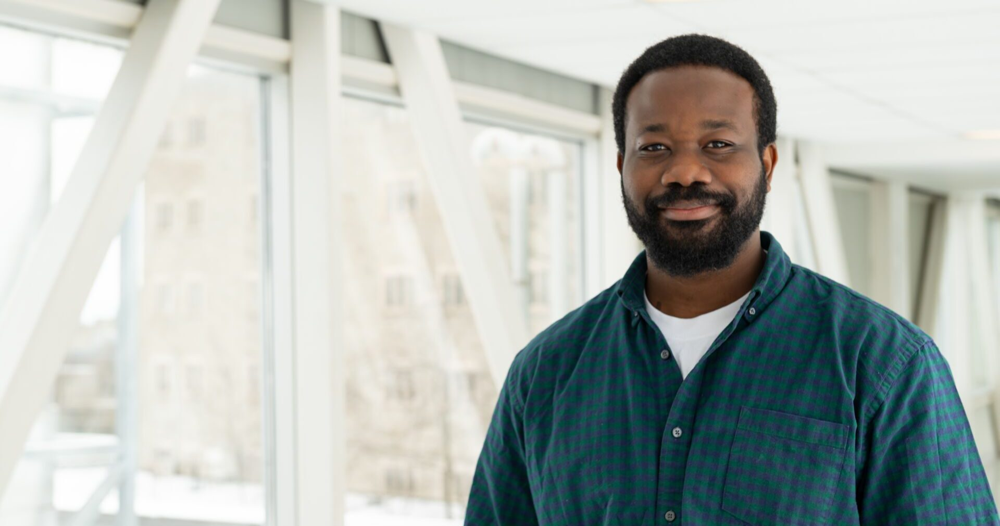

# Meet Your Faculty

<!--#### NAME

>JOB TITLE  
INSTITUTION  
LOCATION
>
> --- CONTACT INFO, IF PROVIDED

BIO GOES HERE-->

### Instructors

#### Dr. Idowu Olawoye

>Postdoctoral Associate  
University of Western Ontario   
London, ON, Canada 
>
> --- iolawoye@uwo.ca

Idowu is a postdoctoral associate in the Guthrie Lab at the University of Western Ontario. His research focuses on utilizing computational biology to understand transmission patterns, genomic evolution, and antimicrobial resistance of bacterial pathogens. He has been involved in numerous bioinformatics workshops and trainings across Africa and most recently in Canada.

### Teaching Assistants

#### Charlie Barclay

>MSc Graduate Student Researcher   
University of British Columbia  
Vancouver, BC, Canada 
>
> --- cbarcl01@mail.ubc.ca

Charlie is an ontology curator at the Centre for Infectious Disease Genomics and One Health (CIDGOH), focusing on data standards for contextual data of genomic epidemiology, including wastewater surveillance. With five years of experience in data management, specializing in biodiversity and genomics data, she also actively contributes to the Public Health Alliance for Genomic Epidemiology (PHA4GE) and the Global Alliance for Genomics and Health (GA4GH).

### Facilitator

#### Neha Ratti (she/her)

>Regional Coordinator, CBH Ontario  
Canadian Bioinformatics Hub, University Health Network   
Toronto, ON, Canada 
>
> --- ontario@bioinformatics.ca 

Neha is passionate about advancing bioinformatics and data science training across the province. With a strong background in project management, event coordination, and stakeholder engagement, she strives to create impactful initiatives that foster collaboration and skill development. Her experience in organizing training programs, developing policies, and building supportive environments enables her to contribute to Ontario’s leadership in the bioinformatics community. 

