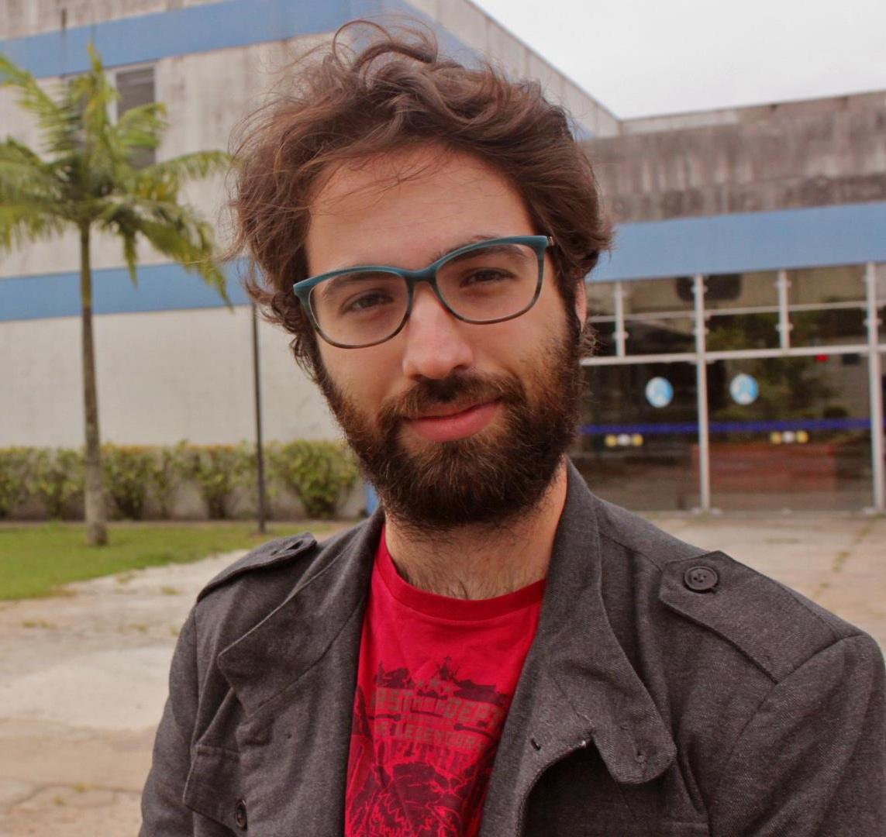
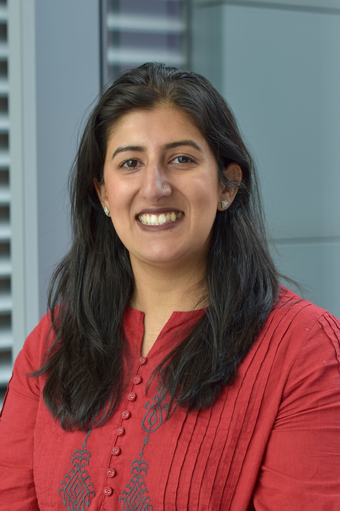
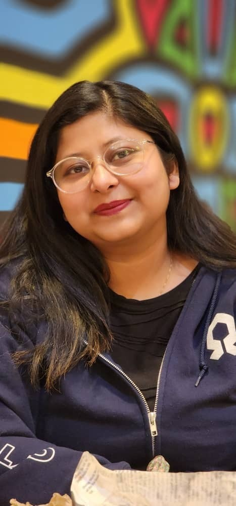

# Meet Your Faculty

<!--#### NAME

>JOB TITLE  
INSTITUTION  
LOCATION
>
> --- CONTACT INFO, IF PROVIDED

BIO GOES HERE-->

### Instructors

#### Diogo Pellegrina (he/him)

>Postdoctoral Fellow
University of Saskatchewan, VIDO
Saskatoon, SK, Canada
>

Diogo is a Postdoctoral Fellow at the Vaccines and Infectious Diseases Organisation (VIDO) at USask. Previously I did my PhD in the University of Sao Paulo, and I was also a Postdoc at OICR. I worked with many types of Bioinformatics pipelines, but mostly with Transcriptomics and Network Analysis.

#### Zhibin Lu (he/him)

>Senior Manager, Digital Research  
University Health Network  
Toronto, ON, Canada 
>
> --- zhibin@gmail.com 

Zhibin Lu is a senior manager at University Health Network Digital. He is responsible for UHN HPC operations and scientific software. He manages two HPC clusters at UHN, including system administration, user management, and maintenance of bioinformatics tools for HPC4health. He is also skilled in Next-Gen sequence data analysis and has developed and maintained bioinformatics pipelines at the Bioinformatics and HPC Core. He is a member of the Digital Research Alliance of Canada Bioinformatics National Team and Scheduling National Team.

### Teaching Assistants

#### Alyona Ivanova

>PhD Candidate   
University of Toronto, The Hospital for Sick Children  
Toronto, BC, Canada 
>
> --- alyona.ivanova@mail.utoronto.ca

Alyona is a graduate student at the University of Toronto pursuing PhD in Medical Sciences. Her research focuses on identifying novel therapies for targeting chemo-resistance in glioblastoma using spatial ‘omics technologies. She works in close collaboration with clinicians, neuropathologists, scientists bridging the gap between clinical practice and fundamental lab research. Alyona is a Creative Director of Panoramics - A Vision, and an Executive Editor and Director of Distribution of the Institute of Medical Sciences Magazine. 

### Facilitator

#### Neha Ratti (she/her)

>Regional Coordinator, CBH Ontario  
Canadian Bioinformatics Hub, University Health Network   
Toronto, ON, Canada 
>
> --- ontario@bioinformatics.ca 

Neha is passionate about advancing bioinformatics and data science training across the province. With a strong background in project management, event coordination, and stakeholder engagement, she strives to create impactful initiatives that foster collaboration and skill development. Her experience in organizing training programs, developing policies, and building supportive environments enables her to contribute to Ontario’s leadership in the bioinformatics community. 

#### Riya Roy (she/her)

>Regional Coordinator, CBH Prairies  
Canadian Bioinformatics Hub, University of Manitoba   
Winnipeg, MB, Canada 
>
> --- prairies@bioinformatics.ca 

Riya is currently in the final year of her Ph.D. in Biomolecular Science, specializing in the molecular biology of non-coding RNAs. She holds a Bachelor’s degree in Microbiology and a Master’s degree in Bioinformatics from India. In 2025, Riya joined the Canadian Bioinformatics Hub as the Regional Coordinator for the Prairie region. With a strong interest in science communication and public engagement, Riya is committed to advancing bioinformatics education and fostering stronger connections within both regional and national bioinformatics communities.
