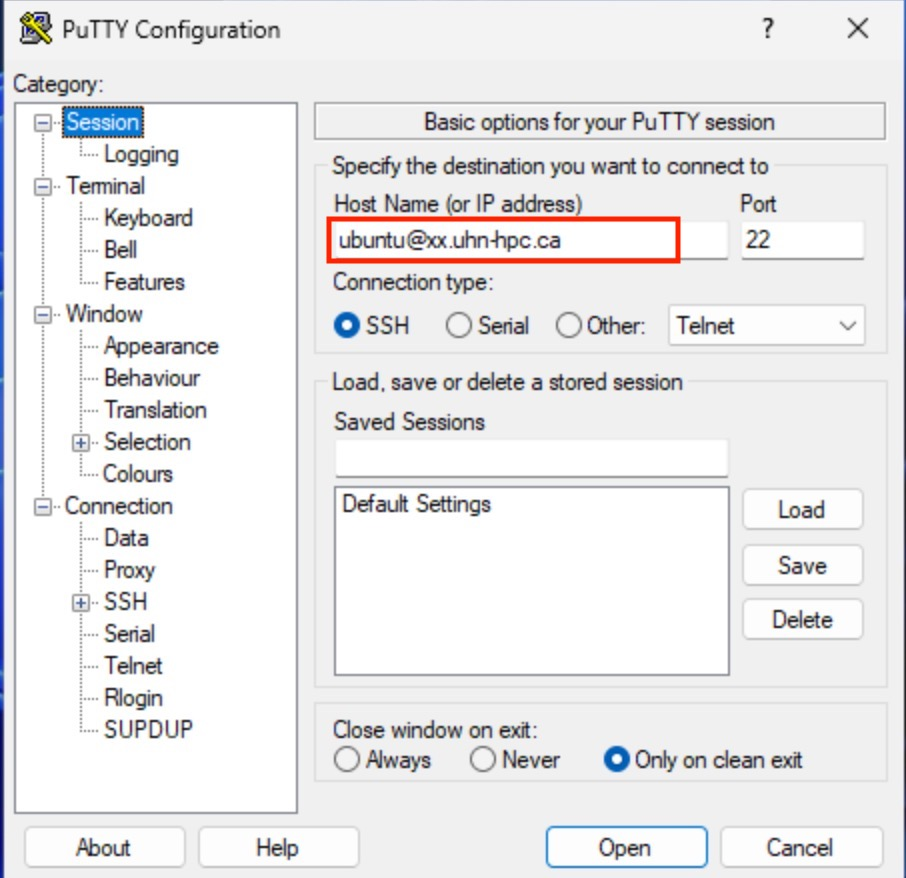
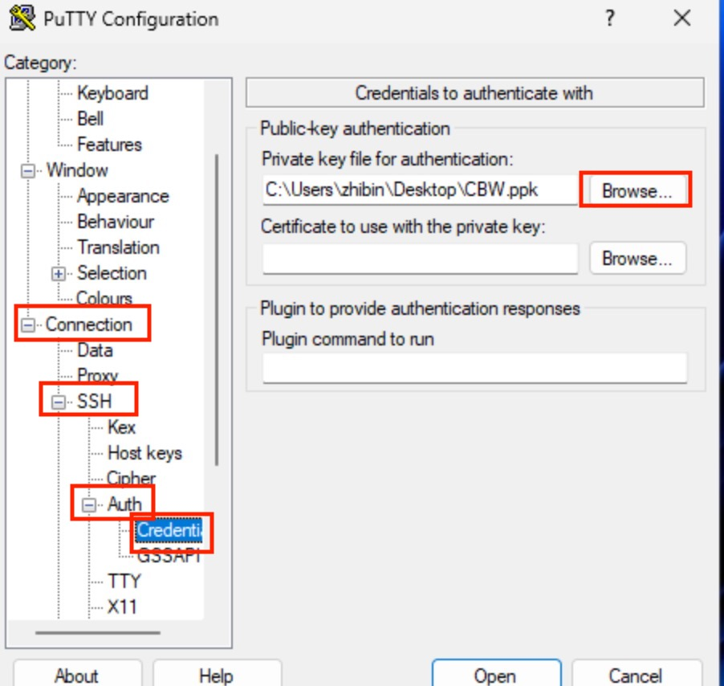
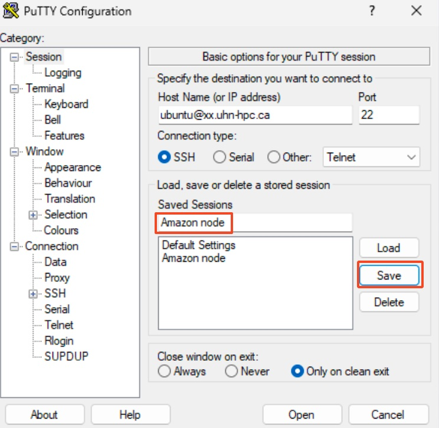

# 1. Logging into AWS

[Slides]().

### Logging into the Amazon Cloud During the Workshop  

* These instructions will **ONLY** be relevant in class, as the Cloud will not be accessible from home in advance of the class.
 
* On the cloud, we're going to use the default username: **ubuntu**
 

### Logging in with ssh (Mac/Linux)

* Make sure the permissions on your private key are secure. Use chmod on your downloaded pem file:

```bash
 chmod 600 CBW.pem
```

* To log in to the instance, use the -i command line argument to specify your private key:

```bash
 ssh -i CBW.pem ubuntu@##.uhn-hpc.ca
```

(where ## is your assigned student number.)

### Logging in with Putty (Windows)

* Fill in the "Host name" field with ubuntu@##.uhn-hpc.ca (where ## is your assigned student number.)
 


* In the left hand categories, in the Connection category next to SSH click on the **+**. Click on **+** next to Auth and then click Credentials. In the private-key file for authentication field, hit browse and find the CBW.ppk file that you downloaded.



* In the left hand categories, click on Session.  In the Saved Sessions field write **Amazon node** and click save.



**Now that Putty is configured**, all you have to do is start putty and double-click on "Amazon node" to login.


## File System Layout

When you log in, you'll notice that you have two directories: **CourseData** and **workspace**.

* The **CourseData** directory will contain the files that you'll need to complete your lab assignments.

* The **workspace** directory is where you will work on your labs. Files here will be accessible through your browser.

## Workspace

* Everything created in your workspace on the cloud is also available by a web server on your cloud instance.  Simply go to the following in your browser:

```
 http://##.uhn-hpc.ca/
```
(where ## is your assigned student number.)

## RStudio 
* RStudio server is installed on your instance. It is accessible in your browser
```
 http://##.uhn-hpc.ca:8080
```
(where ## is your assigned student number.) The username is ***ubuntu***. We will give you the password in class.
